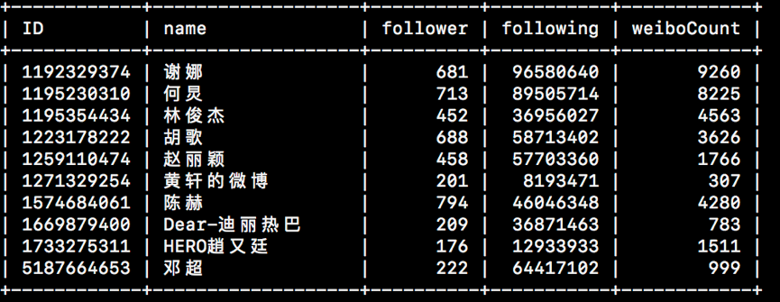
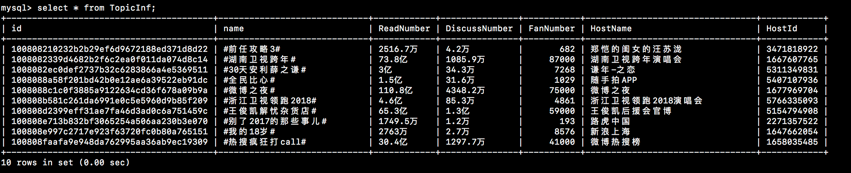
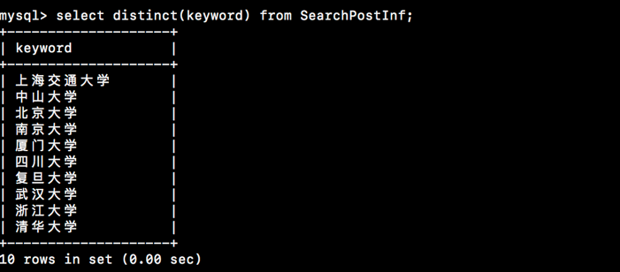

#微博爬虫

###爬取内容：   

* 10个id（可以指定并写死）：  
（1）id基本信息：id，昵称，关注数，关注人列表（前100人），粉丝数，粉丝列表（前100人），微博数  
（2）id-post（前500）：link，发布人，发布人id，发布时间（转化为绝对时间），来自，评论数，评论列表（前50），转发数，赞数，本post是否转发，（如是）原post发布人，（如是）原post发布时间（转化为绝对时间），（如是）原post来自，（如是）原post评论数，（如是）原post转发数，（如是）原post赞数  

*  10个topic（可以指定并写死）：  
（1）topic基本信息：topic-id，名称，阅读数，讨论数，粉丝数，粉丝列表（前100人），主持人，主持人id  
（2）topic-post（前500，就是主持人推荐）：link，发布人，发布人id，发布时间（转化为绝对时间），来自，评论数，评论列表（前50），转发数，赞数，本post是否转发，（如是）原post发布人，（如是）原post发布时间（转化为绝对时间），（如是）原post来自，（如是）原post评论数，（如是）原post转发数，（如是）原post赞数

* 10个搜索词（可以指定并写死）  
	搜索结果post（前500）：link，发布人，发布人id，发布时间（转化为绝对时间），来自，评论数，评论列表（前50），转发数，赞数，本post是否转发，（如是）原post发布人，（如是）原post发布时间（转化为绝对时间），（如是）原post来自，（如是）原post评论数，（如是）原post转发数，（如是）原post赞数

###使用语言和框架
* 使用语言：java  
* 框架：Jsoup/selenium+phantomjs  
* 数据库：mysql  

###运行配置
如果需要运行代码，请修改以下几个部分：

* 微博  
**CookieInfo.java**：  

		static String cookieForCn2 = Your cookie for www.weibo.cn;
		static String cookieForCom = Your cookie for www.weibo.com;
		static String RefererForCom = Your referer for www.weibo.com;
		static String UserAgent = Your useragent for www.weib.com/www.weibo.cn
		
		eg.
		static String UserAgent = "Mozilla/5.0 (Macintosh; Intel Mac OS X 10_12_6) AppleWebKit/604.3.5 (KHTML, like Gecko) Version/11.0.1 Safari/604.3.5";

* phantomjs  
**PhantomjsInfo.java**:

		static String path = the path that you install your phantomjs;
		static String username = Your weibo username;
		static String password = Your weibo password;

* 数据库  
**SqlConnect.java**：

		private static String user = "YOUR MYSQL USERNAME";
		private static String password = "YOUR PASSWORD";  

同时请确认已经创建好了需要的数据库（数据库名为weibo）。
数据库的scheme在weibo.sql中。

同时代码需要bin文件夹中的所有的jar包，请在project properties中进行添加。

###数据存储结构

存入的数据库中总共建表14张  

10个id

* UserFollower         
* UserFollowing      
* UserInf              
* UserPostComment      
* UserPostInf         
* UserPostOriginInf 
   
10个topic  

* TopicFan             
* TopicInf             
* TopicPostComment     
* TopicPostInf         
* TopicPostOriginInf  
 
10个搜索词  
           
* SearchPostComment    
* SearchPostInf        
* SearchPostOriginInf 

###数据结果

本次爬取的数据情况如下：

* ID
爬的用户的信息如下：



总共爬取微博4824条，评论247613条，转发的微博信息2514条。用户关注总共1018条，用户粉丝总共1035条（注，因为在爬的过程中如果数据已经超过了规定的数额（如500，会把该页面中所有的剩余相关信息也都爬下来，所有像用户关注数会比理论上的1000条多18条）

* 	Topic


爬虫选取当前的热搜话题的前十个topic进行爬取。上图中的十条的热点话题为2017.12.31日早上9:30的热点话题。该部分总共爬到主持人推荐的微博3369条，评论15132条，转发的微博信息2条。

*	SearchWord


本部分的爬虫选取了十个大学作为关键词进行搜索，总共爬到微博5032条，评论12284条，转发的微博信息630条。

